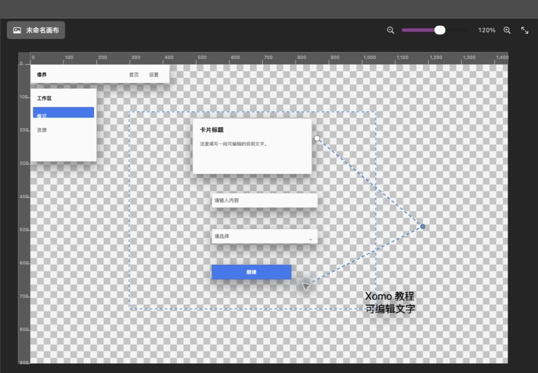
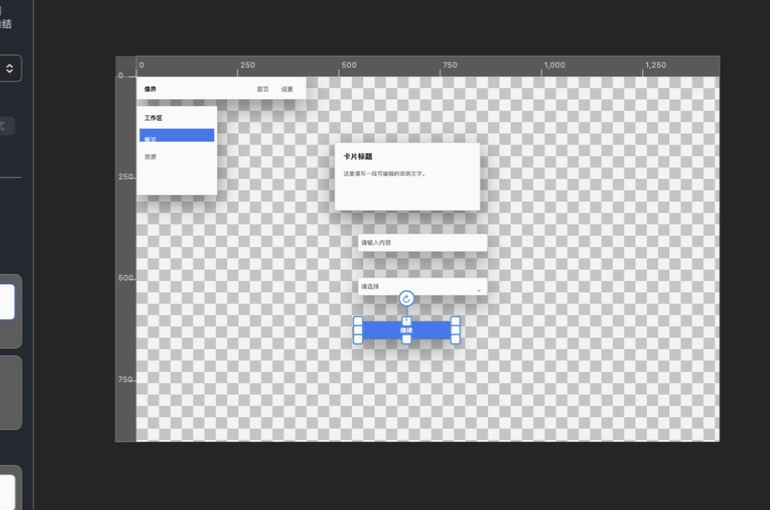

<div align="center">


# Xomo 象墨

**A Photoshop-class image editor for macOS, written in Swift — and one your AI agent can actually drive.**

Layers · masks · smart objects · layer comps · PSD in **and** out · 146 automation tools over MCP/CLI

[](#requirements)
[](https://github.com/niuwoai/xomo)
[](#automation-and-ai-agents)
[](https://github.com/niuwoai/xomo/releases/latest)
[](https://github.com/niuwoai/xomo/stargazers)
[](https://github.com/niuwoai/xomo/actions/workflows/ci.yml)

<a href="https://github.com/niuwoai/xomo/releases/latest"><b>⬇︎ Download the DMG</b></a> ·
<a href="docs/xomo-tutorial/README.md"><b>Read the tutorial</b></a> ·
<a href="XOMO_MCP.md"><b>Automation reference</b></a>


<sub>Screenshots are of the real app — no mockups, no renders. Code, README and CLI output are English; the illustrated tutorial and the MCP reference are 中文 today.</sub>

</div>

---

**Jump to:** [Why Xomo exists](#why-xomo-exists) · [Try it in 60 seconds](#try-it-in-60-seconds) · [Screenshots](#screenshots) · [What's inside](#whats-inside) · [Automation and AI agents](#automation-and-ai-agents) · [Extend it](#extend-it) · [Install](#install) · [Scope, honestly](#scope-honestly) · [Documentation](#documentation) · [Contributing](#contributing) · [License](#license)

---

## Why Xomo exists

macOS never got a pixel editor that treats design work as *structured, scriptable data*. Xomo is a native Swift/SwiftUI editor that keeps the Photoshop mental model — layers, masks, channels, history, 28 tools — but makes every single operation addressable from the command line and from an AI agent:

| | |
|---|---|
| **It is genuinely native** | 160+ Swift sources, 140k+ lines, no web view, no Electron, no Python runtime. Universal binary (Apple silicon + Intel), notarized Developer ID, Sparkle auto-update. |
| **It is genuinely scriptable** | 146 automation tools cover the same code path as the UI: selections, masks, layer effects, PSD I/O, exports, Figma import. Wire it into Claude Code, Cursor, or a shell script and the canvas responds. |
| **It exchanges files instead of trapping you** | Opens *and writes* layered PSD, imports Figma links/SVG/PSD, exports PNG/JPEG/WebP/PDF/SVG/PSD, and stores its own work in an open `.xomoproject` format. |
| **It stays non-destructive** | Editable text, vector paths, named path library, shape fills/strokes, layer effects, smart objects, smart filters, layer comps, adjustments — all re-editable, with a full Undo/History spine. |

> ⭐ If this is the macOS editor you've been waiting for, **star the repo** — that is how this project gets found.

---

## Try it in 60 seconds

**1 · Get the app.** [Download the DMG](https://github.com/niuwoai/xomo/releases/latest), drag it into `/Applications`, open it. It is notarized, so Gatekeeper opens it without an "unidentified developer" detour. No account, no sign-in, no network call needed to edit.

**2 · Give your agent a canvas.** The `xomo` CLI is a standalone universal binary, and it already knows how to write its own MCP config:

```bash
scripts/build_xomo_cli_release.sh      # -> dist/xomo-macos-universal
dist/xomo-macos-universal install      # -> ~/.local/bin/xomo
xomo mcp-config                        # prints the mcpServers block to paste
```

**3 · Drive it.** With the app running, every call below runs through the *same* code path as the UI, lands as a single Undo step, and is rejected atomically when an argument is invalid:

```bash
xomo status
xomo tools
xomo call xomo.document.create '{"preset":"socialSquare","background":"white"}'
xomo call xomo.shape.create    '{"kind":"rectangle","x":40,"y":40,"width":240,"height":160}'
xomo call xomo.text.create     '{"text":"Hello, canvas","x":80,"y":120,"fontSize":48}'
xomo export ~/Desktop/hello.png --format png --scope composited --scale 2
```

---

## Screenshots

| Selections, crop, canvas nav | Vector paths, anchors and handles |
|---|---|
|  |  |
| **Gradients & fills** | **Photo retouching** |
|  |  |
| **UI component library (22 families × 7 themes)** | **Layers, channels, history** |
|  |  |

More real screenshots: [toolbox](docs/xomo-tutorial/assets/interface/toolbox.png) · [component library](docs/xomo-tutorial/assets/interface/component-library.png) · [channels](docs/xomo-tutorial/assets/interface/channels-panel.png) · [history](docs/xomo-tutorial/assets/interface/history-panel.png) · [full tutorial](docs/xomo-tutorial/README.md)

---

## What's inside

**28 editing tools** — move, marquee/lasso/magic wand/quick selection, crop, brush, eraser, clone stamp, healing brush, patch, red eye, dodge/burn/sponge, blur/sharpen/smudge, paint bucket, gradient, eyedropper + 4 color samplers, text, rectangle/ellipse, pen, hand, zoom. Brush/eraser honour stylus pressure and per-point pressure curves; brush presets persist across sessions.

**Selections the Photoshop way** — rectangle, ellipse, lasso, magic wand, quick selection, select all/inverse, color range, similar/expand colors, feather, smooth, fill/stroke/clear, content-aware fill, plus a full **Quick Mask** (query state, override target/color/opacity, brush-edit strokes) that shares its code path with the UI.

**Layers that behave** — groups and nesting, clipping masks, links, merge/flatten/stamp visible/selected, align, distribute, geometry transforms, smart objects, Layer Comps, blend modes, layer opacity and fill opacity, locks, Option-click visibility isolation, optional rasterization targets (`type`, `shape`, `fillContent`, `vectorMask`, `smartObject`, `layerStyle`, `layer`).

**Non-destructive effects** — raster *and* vector layer masks, ten layer-effect types with a real compositor, custom style presets (create/apply/rename/reorder/duplicate/favorite/recent/export `.xomostyles`/import with dry-run preview), smart filters, adjustments, and per-layer effect scaling. Every batch action lands as a single History/Undo step.

**Type, shapes, paths** — point and boxed paragraph text with overflow diagnostics and fit-to-content, rectangles and ellipses with independent four-corner radii and squircle corner smoothing, solid/linear/radial gradients (up to 16 ordered stops), pen tool with anchors and handles, and a **named path library** (save, organise, fill, stroke, convert to selection or mask — saved paths survive deleting the source layer).

**PSD in *and* out** — open, inspect and save layered PSD with an explicit compatibility report: PSD v1, 8-bit RGB, Raw/RLE/ZIP/ZIP-prediction channel compression both directions, nested groups, raster masks, blend modes, fill opacity and locks. Basic `TySh`/EngineData text layers come in as editable native text; simple shapes, gradients, dashed strokes and vector masks round-trip as editable objects. Everything Photoshop-proprietary that cannot survive is reported, never silently flattened.

**Design handoff, not just pixels** — Fireworks-style named slices plus hotspots that export as a self-contained HTML image map, Figma link validation and normalisation, Figma variable bindings, Figma image-fill math (scale mode, rotation, crop offsets, affine matrix), Figma component properties and size constraints — all executed **locally, with no network calls and no stored credentials**.

**Component library** — 22 editable UI component families across 7 theme packs (5 Xomo-original, plus Chakra UI and Radix Themes *reference* packs implemented as native editable layers), master components and instance links, theme sync, and design-token automation: get / export / import / apply / refresh `.xomotokens.json` tokens as one Undo step.

**Everything else you'd miss** — alpha channels, guides and grid, canvas/image resize, undo/redo with named snapshots and truncate/restore, system and internal clipboards (paste in place), project import/export (`.xomoproject`, legacy `.qpicproject` still opens), and a fully trilingual UI: **English, 简体中文, 日本語**.

---

## Automation and AI agents

The `xomo` CLI is a standalone universal binary — one file, nothing to install alongside it — and `xomo mcp` is a stdio MCP server that proxies to the running app. The app holds the real canvas; it publishes a loopback-only endpoint file with `0600` permissions, mints a fresh token on every launch, and the CLI reads that token from the file and sends it in the request body — never on the command line.

```json
{
  "mcpServers": {
    "xomo": {
      "command": "/Users/you/.local/bin/xomo",
      "args": ["mcp"]
    }
  }
}
```

```bash
xomo status
xomo tools
xomo call xomo.psd.inspect '{"path":"~/Designs/checkout.psd"}'
xomo call xomo.psd.open    '{"path":"~/Designs/checkout.psd"}'
xomo call xomo.selection.quick_mask '{"action":"paint","points":[{"x":32,"y":32},{"x":96,"y":64}],"reveal":true}'
xomo call xomo.slice.create '{"name":"hero"}'
xomo call xomo.layer.style '{"action":"presetApply","id":"<preset-id>"}'
xomo call xomo.component.tokens '{"action":"export","path":"/Users/you/Desktop/chakra.xomotokens.json"}'
xomo export ~/Desktop/xomo.png --format png --scope composited --scale 2
xomo project export ~/Desktop/design.xomoproject
```

The same call path drives the UI, so an agent gets undoable, composited, real-document edits — not a headless renderer pretending to be one. Unknown enum values are rejected atomically before anything is written to History.

Full list: [`XOMO_MCP.md`](XOMO_MCP.md) *(Chinese)*.

---

## Extend it

Xomo is built to be forked, and the automation surface was deliberately kept in one file so you do not have to learn the whole app to add to it:

| You want to add | Start here |
|---|---|
| **A new automation tool** | [`veilpic/XomoAutomationRegistry.swift`](veilpic/XomoAutomationRegistry.swift) — one `tool("xomo.…")` entry for the JSON schema, one `case` in the executor switch, same file. All **146** tools live there today. |
| **A new UI component family** | [`veilpic/XomoComponentInsertion.swift`](veilpic/XomoComponentInsertion.swift) (`XomoComponentKind`) plus [`veilpic/XomoComponentTheme.swift`](veilpic/XomoComponentTheme.swift) — **22** families across **7** theme packs today. |
| **A PSD import/export capability** | [`docs/PSD_SUPPORT.md`](docs/PSD_SUPPORT.md) states what round-trips, what degrades to pixels, and why. The compatibility report is the contract: never silently flatten. |
| **A UI feature** | [`PHOTOSHOP_CLASSIC_ROADMAP.md`](PHOTOSHOP_CLASSIC_ROADMAP.md) and [`XOMO_UI_DESIGN_ROADMAP.md`](XOMO_UI_DESIGN_ROADMAP.md) list the gaps in priority order — pick one and send a PR. |

---

## Requirements

- **macOS 13 Ventura or newer** (Apple silicon or Intel — the release DMG is universal)
- Working in the canvas, painting and exporting needs no account and no cloud service
- Building from source: Xcode 16+ (the `xomo` CLI package uses `swift-tools-version 6.0`)

## Install

**Download the DMG** — [`releases/latest`](https://github.com/niuwoai/xomo/releases/latest). Signed and notarized with Developer ID, so Gatekeeper opens it without any "unidentified developer" dance:

```bash
spctl -a -t open --context context:primary-signature -vv ~/Downloads/Xomo-*.dmg
# accepted — source=Notarized Developer ID
```

**Build from source**

```bash
git clone https://github.com/niuwoai/xomo.git
cd xomo
open veilpic.xcodeproj        # scheme: veilpic
```

The Xcode target is configured for the maintainers' Developer ID team. The `veilpic` scheme is shared, so this works on a fresh clone without opening Xcode first — set your own team, or turn signing off:

```bash
xcodebuild -project veilpic.xcodeproj -scheme veilpic -configuration Debug build CODE_SIGNING_ALLOWED=NO
```

**Build the `xomo` CLI**

```bash
scripts/build_xomo_cli_release.sh          # -> dist/xomo-macos-universal
dist/xomo-macos-universal install          # -> ~/.local/bin/xomo
```

## Tests

The suite is unusually large for an app of this kind — 200+ test sources, 140k+ lines, including pixel-accurate rendering assertions. Pixel and colour-space tests need process isolation (a documented AppKit/Swift Testing interaction), so the repo ships its own runner:

```bash
ruby scripts/run_tests_isolated.rb --jobs 4        # JSON + Markdown report in test-reports/
ruby scripts/run_tests_isolated.rb --filter Filter # or run a subset
```

## Scope, honestly

We would rather you know the edges before you install than after:

- **macOS only.** No Windows or Linux build today.
- **Releases carry `-rc` tags.** 2,230+ logged releases, 7,300+ documented changes and 86 commits in the last 30 days — this is a fast-moving, continuously shipped app rather than a frozen 1.0. GitHub releases are cut at milestones, not for every internal build; the complete per-build log is [`CHANGELOG.md`](CHANGELOG.md).
- **PSD compatibility is broad but not Photoshop-complete.** PSD v1 only (no PSB), 8-bit RGB only (no 16/32-bit, CMYK, grayscale, indexed, Lab). Smart-object internals, adjustment layers, exotic fills and native `vscg`/`vogk` shape descriptors are imported as rendered pixels, each item listed in a compatibility report. See [`docs/PSD_SUPPORT.md`](docs/PSD_SUPPORT.md) for the full matrix.
- **Not a Figma editor.** Figma support is import, inspection, link handling and local token exchange — Xomo never writes back to Figma and never asks for your access token.
- **The rendering test suite is order-sensitive by nature.** That is why the isolated runner exists; a plain parallel `xcodebuild test` will occasionally show false failures.

## Documentation

This README is English; the deep reference docs are written in Chinese today. **Translations are a genuinely useful first PR** — see [Extend it](#extend-it).

| Doc | Language | What's in it |
|---|---|---|
| [`docs/xomo-tutorial/`](docs/xomo-tutorial/README.md) | 中文 | Six-chapter illustrated tutorial covering all 28 tools, the component library, layers, channels, history, import/export and shortcuts |
| [`XOMO_MCP.md`](XOMO_MCP.md) | 中文 | Complete CLI and MCP reference, tool semantics and boundaries |
| [`docs/PSD_SUPPORT.md`](docs/PSD_SUPPORT.md) | 中文 | PSD import/export capability matrix and known degradations |
| [`PHOTOSHOP_CLASSIC_ROADMAP.md`](PHOTOSHOP_CLASSIC_ROADMAP.md) | 中文 | Where the editor is heading, feature by feature |
| [`XOMO_UI_DESIGN_ROADMAP.md`](XOMO_UI_DESIGN_ROADMAP.md) | 中文 | UI/UX direction and component-library plans |
| [`XOMO_COMPONENT_LIBRARY_MANIFEST.md`](XOMO_COMPONENT_LIBRARY_MANIFEST.md) | 中文 | Component-library provenance, licensing and asset inventory |
| [`CHANGELOG.md`](CHANGELOG.md) | 中文 entries | Every release, in reverse order |

## Contributing

Pull requests are welcome. **[`CONTRIBUTING.md`](CONTRIBUTING.md)** has the full picture — setup, test gates, house rules, and worked examples for the two most common contributions. The short version:

- **Translate the docs.** The README is English; the illustrated tutorial, `XOMO_MCP.md` and `docs/PSD_SUPPORT.md` are still 中文. Highest value per hour, and it needs no Swift.
- **Add an automation tool.** [`veilpic/XomoAutomationRegistry.swift`](veilpic/XomoAutomationRegistry.swift) — the JSON schema and its handler live side by side in one file.
- **Take an item off a roadmap.** [`PHOTOSHOP_CLASSIC_ROADMAP.md`](PHOTOSHOP_CLASSIC_ROADMAP.md) and [`XOMO_UI_DESIGN_ROADMAP.md`](XOMO_UI_DESIGN_ROADMAP.md) list the gaps in priority order.

House rules that keep the codebase predictable:

- UI strings must exist in **all three** locales (`en`, `ja`, `zh-Hans`); localisation-key consistency is part of the test gate.
- Behaviour changes need a test. Pixel work must go through explicit `sRGB`/`deviceRGB` colour spaces.
- Batch operations must commit as a **single** History/Undo step, and must fail atomically on invalid input instead of half-applying.
- Run `ruby scripts/run_tests_isolated.rb` before opening a PR.
- If you touch this README, run `ruby scripts/verify_readme.rb` — it re-checks every relative link, every in-page anchor and every headline number against the repository.

Found a bug, or want to propose something? [Open an issue](https://github.com/niuwoai/xomo/issues/new/choose) — there are structured templates for bug reports and feature requests, and they ask for exactly the details that make a fix fast.

## License

**MIT.** Read it, fork it, ship it, sell it — the only obligation is keeping the copyright notice with the source. Full text: [`LICENSE`](LICENSE).

Bundled dependencies and the referenced third-party component packs are attributed in [`THIRD_PARTY_NOTICES.md`](THIRD_PARTY_NOTICES.md).

---

<div align="center">

**If Xomo saves you a Photoshop subscription, or gives your agent a canvas — [⭐ star it](https://github.com/niuwoai/xomo/stargazers) and [🔀 fork it](https://github.com/niuwoai/xomo/fork).**

Found a bug? [Open an issue](https://github.com/niuwoai/xomo/issues). Forked it, or shipped something with it? Tell us there too — we like seeing where this goes.

</div>
