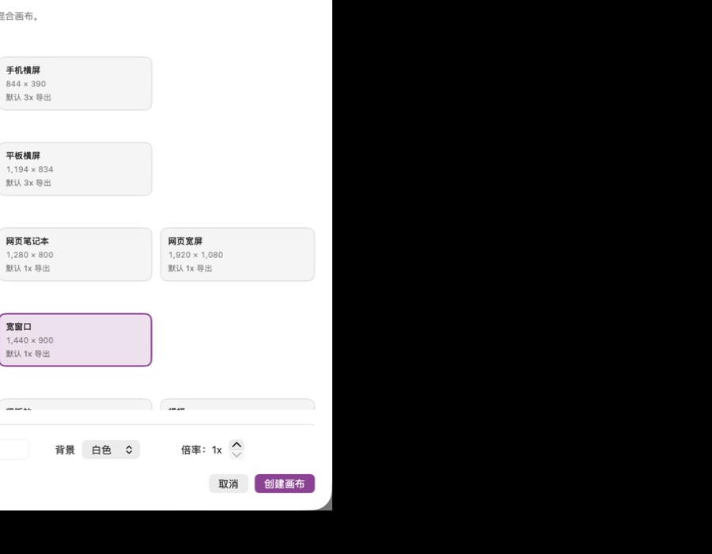
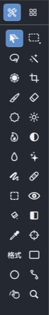
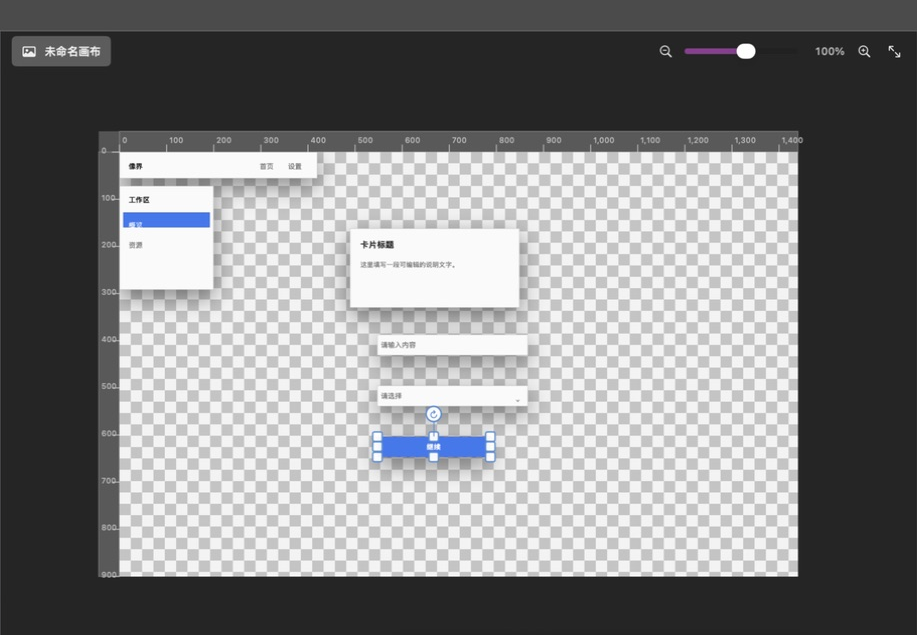

# 第 1 章：快速开始与界面认识

[返回索引](README.md) · [下一章：选区、移动与导航](02-selection-navigation.md)

## 1. 新建设计画布

1. 点击左上角“文件”。
2. 选择“新建设计画布”。
3. 从手机、平板、网页、桌面应用或社交媒体预设中选择尺寸。
4. 需要自定义时，直接修改宽度、高度、背景和导出倍率。
5. 点击“创建画布”。

预设只负责初始化尺寸与设计网格，不会限制后续导入、绘画或导出格式。透明背景适合图标和素材；白色背景更适合网页与界面稿。

## 2. 工作区布局

| 区域 | 用途 |
|---|---|
| 顶部菜单 | 文件、编辑、图像、图层、选择、滤镜、视图和窗口命令 |
| 顶部选项栏 | 根据当前工具显示尺寸、硬度、不透明度、容差、字体等参数 |
| 左侧“工具/组件库” | 在 28 个编辑工具和 UI 组件库之间切换 |
| 中央画布 | 编辑图像、对象、选区和路径；灰白棋盘格表示透明 |
| 画布右上缩放条 | 始终位于画布上层，可直接缩放、显示比例或适合窗口 |
| 右侧面板 | 图层、通道、复合、导航器、信息、历史、滤镜和属性 |
| 底部状态栏 | 当前操作结果、工具、坐标、画布尺寸和缩放比例 |

左侧工具箱的完整外观如下：

## 3. 使用组件库快速开始 UI 设计

1. 点击左侧顶部的“组件库”标签。
2. 在主题下拉中选择组件风格。
3. 单击组件卡片把组件插入画布；也可以把组件拖到目标位置。
4. 点击“插入当前主题页面示例”可一次生成一套可编辑页面。
5. 插入后切回“工具”，用移动或文字工具继续编辑。

组件不是一张扁平截图。按钮、输入框、导航和卡片会展开为组、形状与文字图层，因此文案、颜色、圆角、位置和层级都可继续修改。

切回工具箱后，可以直接在同一画布上继续选择、移动、绘画或添加文字：

## 4. 选择正确的工作对象

- 像素编辑工具需要选中可编辑的像素图层。
- 文字工具可以创建文字，也可以点击现有文字对象继续编辑。
- 矩形、椭圆和钢笔创建的是结构化形状或路径对象。
- 点击画布上的未遮挡对象时，Xomo 会自动切换到它所在的图层并选中对象。
- 若工具没有反应，先检查所选图层是否锁定、是否为正确类型，以及是否存在有效选区。
