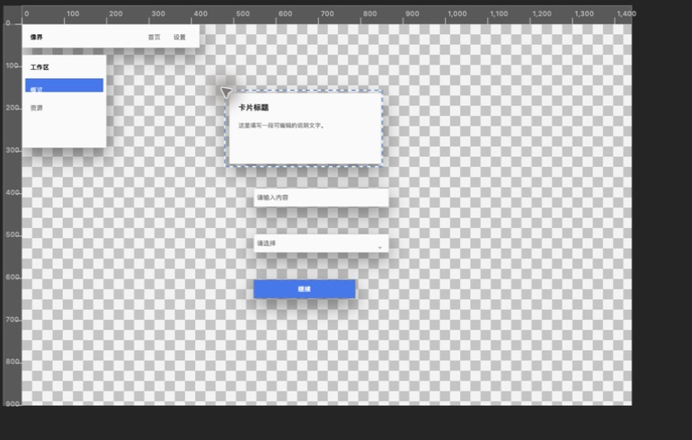
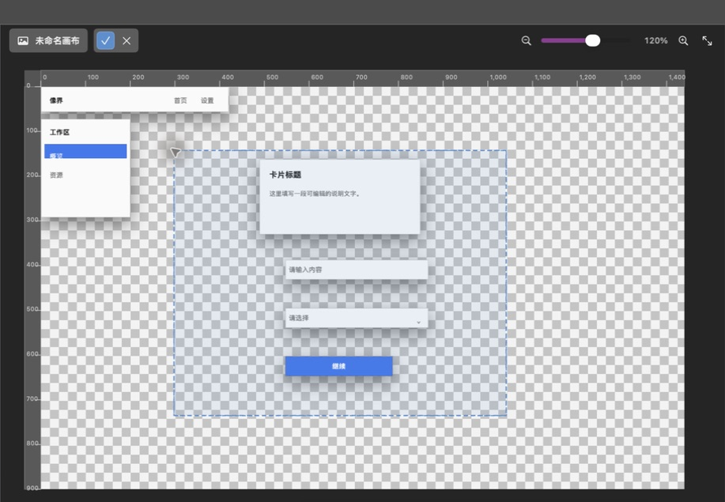

# 第 2 章：选区、移动、裁剪与画布导航

[上一章：快速开始](01-quick-start.md) · [返回索引](README.md) · [下一章：绘画与修图](03-paint-retouch.md)

## 移动工具

移动工具用于选择对象和改变位置，快捷键是 `V`。

1. 选择移动工具。
2. 点击画布上一个未被遮挡的对象；Xomo 会选中它并切换到对应图层。
3. 拖动对象。拖动过程中显示灰色虚线外框，松开鼠标后才提交最终位置。
4. 需要微调时使用方向键：方向键移动 `1 px`，`Option+方向键` 移动 `5 px`，`Shift+方向键` 移动 `10 px`。
5. 选中对象后按 `Delete` 可删除该对象。

在移动工具的默认状态下，如果按下的位置没有命中任何可选对象，直接拖动会平移整个画布视图，而不会误移当前图层。如果拖动的是像素选区而不是完整图层，移动范围只作用于选区内容。若对象被其他图层完全遮住，可直接在图层面板选择它。

切到组件库后，画布也会自动使用移动/选择语义并恢复系统箭头：点击组件或其他可见对象会选中它所在的图层，拖动对象会移动对象，拖动空白处会平移画布。Xomo 会记住离开工具箱前使用的工具，切回工具箱时继续使用；组件库中的箭头不会在暗地里继续画笔、裁剪或建立选区。

画布光标表达的是当前操作方式：笔刷类显示真实笔刷直径，精确定位类使用十字准星，钢笔使用笔尖，文字使用插入光标，缩放使用带加号的放大镜。工具栏图标只作为必要的辅助识别，不会取代主要交互形状。

## 规则选区工具

快捷键 `M`。工具右下角的展开按钮可以在矩形、正方形、椭圆和圆形之间切换。

1. 在顶部选项栏选择选区模式：新建、添加、减去或相交。
2. 按需要设置羽化半径。
3. 在画布上从一个角拖到对角。
4. 松开鼠标后出现动态虚线边界，表示选区已经生效。

常用命令：

- `Command+A`：选择整个画布。
- `Command+D`：取消选区。
- `Command+Shift+D`：重新选择最近一次选区。
- `Command+Shift+I`：反选。
- `Command+Option+D`：羽化选区。

## 套索工具

快捷键 `L`。套索适合轮廓不规则、但肉眼容易沿边界描画的对象。

1. 选择套索，并设置新建/添加/减去/相交模式。
2. 按住鼠标沿目标轮廓连续描画。
3. 回到起点附近并松开；Xomo 会闭合轮廓并建立选区。
4. 边缘过硬时可增加羽化，或与快速选择、魔棒组合修正。

描画过程中尽量保持连续，不要频繁停顿。小范围修边时放大画布会更稳定。

## 魔棒工具

快捷键组为 `W`。魔棒按颜色相似度选择相连区域，适合纯色背景、图标底色和色块。

1. 在顶部选项栏设置容差；容差越大，纳入的颜色范围越宽。
2. 选择选区模式。
3. 点击目标颜色区域。
4. 漏选时改为“添加”并点击遗漏区域；多选时改为“减去”并点击不需要的区域。

透明区、渐变和压缩噪点会影响结果。背景颜色不均匀时，快速选择通常比魔棒省事。

## 快速选择工具

与魔棒共用 `W` 快捷键组。它像画笔一样逐步扩展相似区域。

1. 设置画笔大小、硬度和选区模式。
2. 在目标内部拖动，不必精准描边。
3. Xomo 根据笔触附近的颜色与纹理扩展选区。
4. 用“添加”补漏，用“减去”清除溢出的部分。

建议先用较大的笔刷选主体，再缩小笔刷处理边缘。

## 裁剪工具

快捷键 `C`。裁剪会改变整个画布尺寸，而不是只隐藏某个图层。

1. 选择裁剪工具。
2. 在画布上拖出准备保留的范围。
3. 检查裁剪框和画面构图。
4. 点击画布工具条上的对勾确认，或点击叉号取消。

确认前可以重新拖出范围。裁剪后，选区应自动匹配新的完整画布；如果结果不满意，立即按 `Command+Z`。

## 抓手工具

快捷键 `H`。抓手只平移观察位置，不会移动图层内容。

1. 放大画布后选择抓手。
2. 在画布区域按住并拖动。
3. 松开鼠标后画布停在新的观察位置。

不想切换工具时，可以在任意工具下按住空格，再按住鼠标拖动画布；松开空格会自动恢复原来的工具。文字输入框正在编辑时，空格仍用于输入文字，不会触发抓手。

抓手最适合在高倍率下查看边缘细节。拖动时鼠标会变成闭合手掌；想回到整体视图，可使用“适合窗口”。

## 缩放工具

快捷键 `Z`。

- 单击画布：放大。
- 按住 `Option` 单击画布：缩小。
- 画布右上角的减号、滑块、百分比、加号和“适合窗口”按钮始终可以点击。
- `Command++`：放大。
- `Command+-`：缩小。
- `Command+1`：实际像素（100%）。
- `Command+0`：适合窗口。

缩放与抓手只改变视图，不改变图像实际尺寸。状态栏中的百分比是当前观察倍率。
