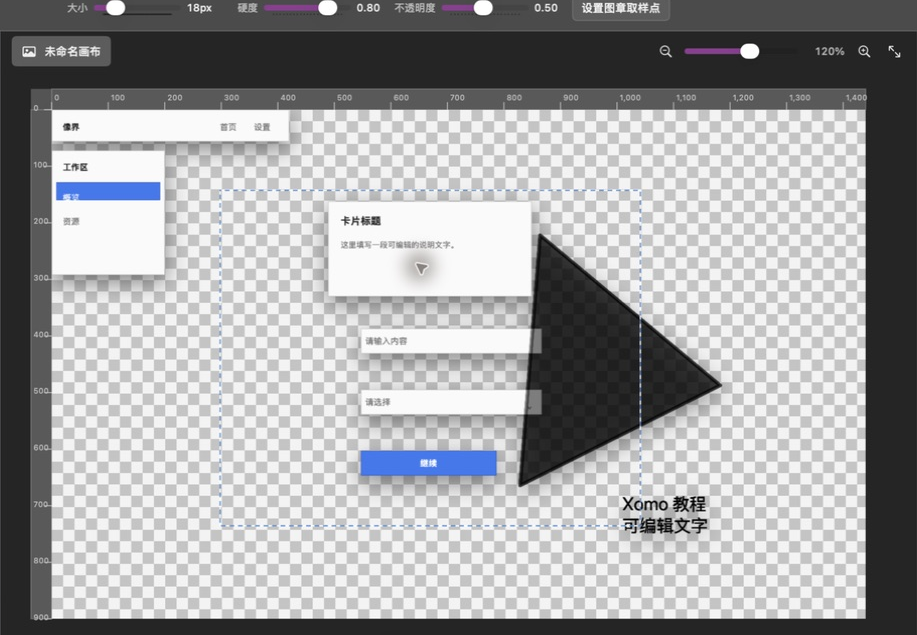
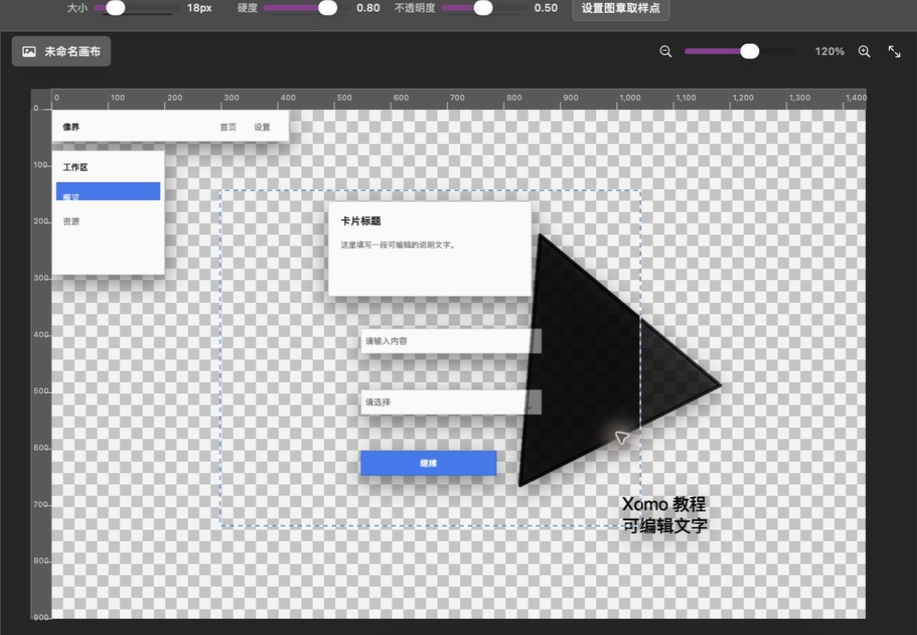
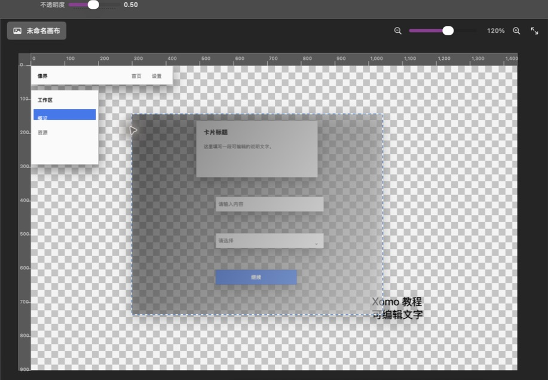

# 第 3 章：绘画、填充与照片修饰

[上一章：选区与导航](02-selection-navigation.md) · [返回索引](README.md) · [下一章：文字、形状与路径](04-text-shapes-paths.md)

> 本章大多数工具会直接修改当前像素图层。开始前建议复制图层；文字、形状、组或锁定图层不能直接接受像素笔触。

## 画笔工具

快捷键 `B`。

1. 选择一个未锁定的像素图层。
2. 点击左下角前景色方块设置颜色。
3. 在顶部选项栏设置大小、硬度、不透明度、流量和间距；使用数位笔时，可在“笔压”菜单中分别启用大小和流量控制，并选择灵敏度。
4. 经常使用同一套参数时，打开“画笔预设”，选择“从当前设置新建预设”；以后可从同一菜单恢复完整设置，或删除当前匹配的自定义预设。内置预设不会被删除。
5. 在画布上按住并拖动完成笔触。

小硬度适合柔和阴影，高硬度适合图标边缘和像素明确的描画。流量决定每个笔尖印章一次沉积多少颜色，反复经过同一区域会逐步加深，但不会超过不透明度上限；间距按笔尖直径百分比控制，较小值形成连续笔触，较大值会清楚显示独立印章。存在选区时，笔触只影响选区内部。

笔压灵敏度为 50% 时采用线性响应；提高灵敏度后，轻压也会更快得到较大的笔尖和较深的颜色，降低灵敏度则需要更用力。普通鼠标会自动按满压处理，无须关闭笔压选项。单击画布也会留下一个完整笔尖印章。

## 橡皮擦工具

快捷键 `E`。用法与画笔相同，但笔触会把像素擦成透明。

1. 选择像素图层。
2. 设置大小、硬度、不透明度、流量和间距。
3. 在要清除的位置拖动。

如果图层没有透明通道或希望保留可逆编辑，优先使用图层蒙版，而不是直接擦除。

## 仿制图章工具

快捷键 `S`。仿制图章需要先指定取样点，再把该处像素复制到目标位置。

1. 选择含有可见像素的像素图层。
2. 点击顶部“设置图章取样点”；也可以按住 `Option` 点击画布。
3. 在干净纹理处单击，状态栏显示“已设置仿制图章取样点”。
4. 在目标区域拖动，取样区域会按相对位移同步复制。
5. 纹理对不上时重新设置取样点，不要用同一个源覆盖太大范围。

## 减淡、加深与海绵

| 图标 | 工具 | 用途 | 操作 |
|---|---|---|---|
|  | 减淡 | 提亮局部 | 选择 `O` 组中的减淡，设置笔刷后在目标上拖动 |
|  | 加深 | 压暗局部 | 切换到加深，以较低不透明度多次涂抹 |
|  | 海绵 | 提高局部饱和度 | 在颜色偏灰的区域轻扫，避免一次过量 |

三者共用 `O` 快捷键组。自然修图建议使用较低不透明度，多次累积比一次重手更容易控制。

## 模糊、锐化与涂抹

| 图标 | 工具 | 用途 | 注意事项 |
|---|---|---|---|
|  | 模糊 | 柔化噪点和硬边 | 避免覆盖关键轮廓 |
|  | 锐化 | 增强边缘细节 | 过量会产生光晕和噪点 |
|  | 涂抹 | 推动并混合像素 | 沿纹理方向拖动更自然 |

三者共用 `R` 快捷键组，并使用大小、硬度和不透明度控制。

## 修复画笔工具

快捷键组为 `J`。修复画笔会参考瑕疵周围的纹理来覆盖小缺陷。

1. 选择像素图层并放大目标。
2. 把笔刷设得略大于斑点、划痕或灰尘。
3. 单击小瑕疵，或沿细划痕短距离拖动。
4. 一次处理一个小区域；大面积修复改用修补或仿制图章。

## 修补工具

与修复画笔共用 `J` 快捷键组。

1. 从瑕疵区域的一角拖到另一角，建立准备替换的矩形范围。
2. 指向一块干净、纹理相似的区域作为来源。
3. 松开鼠标应用修补。
4. 边缘不自然时撤销，缩小范围后分几次完成。

修补范围越大，光照和纹理越难匹配。

## 红眼工具

与修复画笔共用 `J` 快捷键组。

1. 放大眼睛区域。
2. 选择红眼工具。
3. 在红色瞳孔中心单击。
4. 检查瞳孔是否仍保留高光和亮度；必要时撤销后缩小处理范围。

## 油漆桶工具

快捷键组为 `G`。油漆桶用前景色填充相邻的相似颜色区域。

1. 设置前景色。
2. 在顶部设置容差和不透明度。
3. 点击需要填充的区域。
4. 漏填时提高容差；溢出时降低容差或先建立选区。

在透明图层上点击透明区域，可以快速建立纯色底块。

## 渐变工具

与油漆桶共用 `G` 快捷键组。渐变使用当前前景色和背景色。

1. 设置前景色与背景色。
2. 选择一个像素图层；若只想影响局部，先建立选区。
3. 设置不透明度。
4. 从渐变起点拖到终点：拖动方向决定渐变方向，距离决定过渡长度。

## 吸管与颜色取样器

| 图标 | 工具 | 使用方法 |
|---|---|---|
|  | 吸管 | 快捷键 `I`；点击画布像素，把颜色设为前景色 |
|  | 颜色取样器 | `I` 组循环；点击画布保留 RGB 取样点，最多四个 |

颜色取样点适合比较同一设计中的背景、主色和强调色。数值可在“导航器 / 信息”面板查看；它们是辅助标记，不会写入导出图像。
