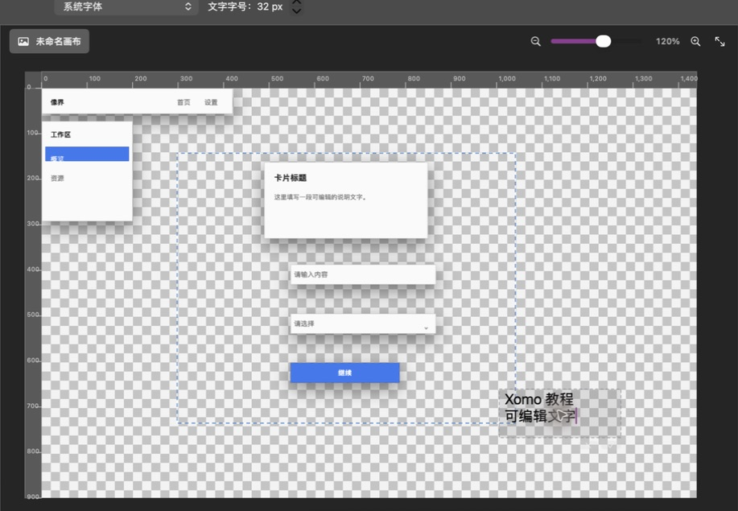
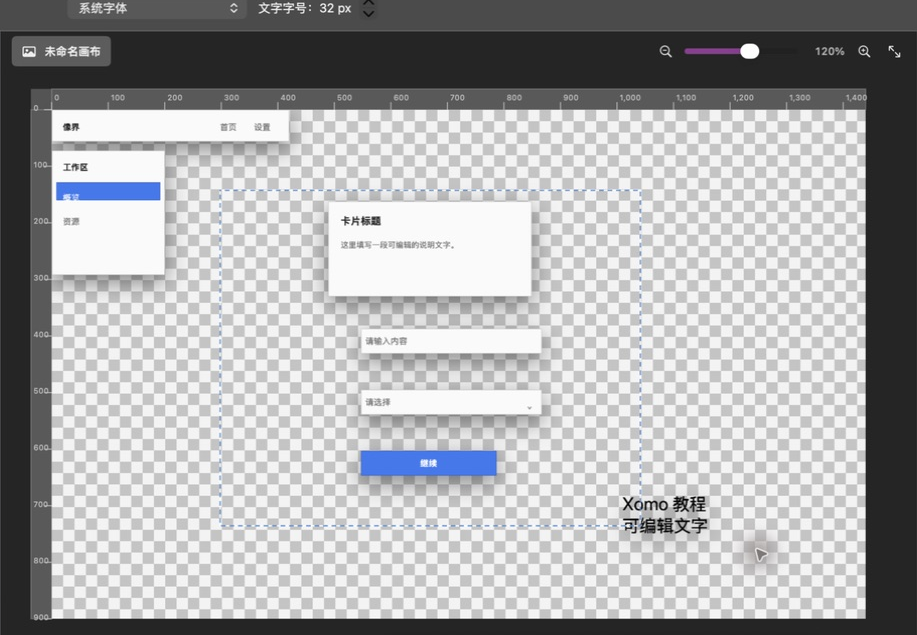
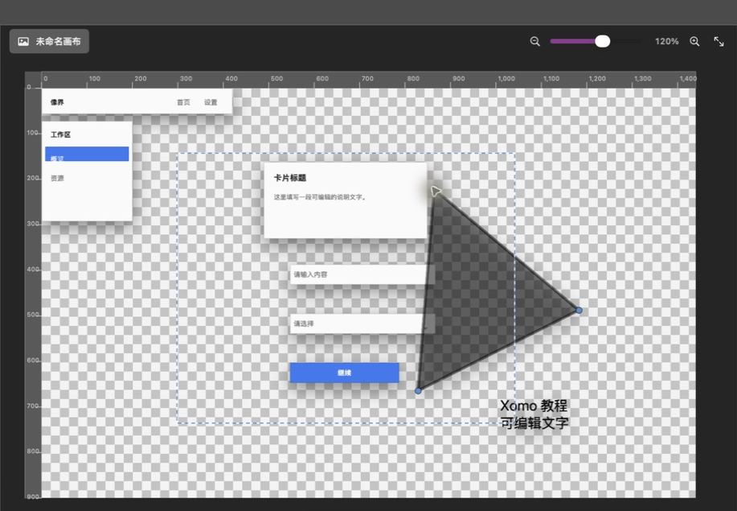

# 第 4 章：文字、形状与钢笔路径

[上一章：绘画与修图](03-paint-retouch.md) · [返回索引](README.md) · [下一章：图层、通道与历史](05-layers-channels-history.md)

本章工具创建的是独立对象图层。它们保留文字内容、字体、填充、描边或路径锚点，适合 UI 设计和后续修改。

## 文字工具

快捷键 `T`。

### 新建文字

1. 选择文字工具。
2. 在画布目标位置单击可创建点文字；按住并拖出矩形可创建固定宽高的段落文字框。
3. 拖动时画布会实时显示最终文字框的虚线边界，向任意方向拖动都可以。
4. 松开后会在同一位置、以同一大小打开输入框；在顶部选项栏选择字体和字号，再输入单行或多行文字。
5. 点击输入框旁的对勾提交；点击叉号取消。

提交后，文字成为独立图层并保持正常阅读方向。

### 编辑现有文字

1. 保持文字工具。
2. 点击画布上的文字对象，Xomo 会切换到它所在的文字图层。
3. 修改内容后点击对勾。
4. 若点击新的空白位置，当前文字会先提交，然后在新位置打开新的输入框。

更多排版参数位于“属性”面板，包括字体、字号、粗体、斜体、下划线、删除线、字符间距、行距、文本框宽高和对齐方式。高度为 0 时随内容自动增长，拖拽创建的段落文字默认保留固定高度。切到移动工具并显示变换控件后，可以拖动八个手柄调整段落文字框：这里只会改变容器并重新换行，不会缩放字号；内容放不下时，文本框右下角会显示加号，属性面板也会提示文字溢出。“文本框适合内容”会把固定高度精确增减到当前内容所需高度；“扩高以显示全部”只增长溢出的文本框，不会收掉已有留白。下划线与删除线可以独立或同时启用；对段落文字可选择左右两端对齐，并分别设置左缩进、右缩进与首行缩进，负的首行缩进可形成悬挂效果。修改既有文字后执行更新即可写回文字图层，多选多个未锁定文字层时会一次应用到全部所选文字层。

点文字适合标题、标签等内容随文字自然伸展的场景；段落文字适合正文和固定宽度卡片。在属性面板或“窗口 → 段落”中选择“转换为段落文字”，会以当前点文字的自然宽度建立文本框且不移动图层；“转换为点文字”会取消文本框的自动换行。批量选择多个文字层也可以一次转换，锁定层不会被修改。

## 矩形与椭圆工具

| 图标 | 工具 | 快捷键 |
|---|---|---:|
|  | 矩形 | `U` |
|  | 椭圆 | `U` 组循环 |

1. 选择矩形或椭圆。
2. 在顶部设置不透明度；填充、描边等详细参数可在属性面板调整。
3. 从一个角拖到另一个角。
4. 松开后生成独立形状图层。
5. 用移动工具选择、拖动或通过变换控制点缩放。

矩形适合按钮、卡片、输入框和背景；椭圆适合头像、徽章、状态点和圆形按钮。需要保持长宽比时，在变换过程中按住 `Shift`。

### 编辑形状渐变

1. 在形状属性中把填充切换为“线性渐变”，并切回移动工具。
2. 画布会显示渐变轴、起止端点和中间色标；拖动端点可调整方向与跨度，按住 `Shift` 以 15° 吸附。
3. 双击渐变轴可在鼠标位置新增色标；新颜色会从当前位置的渐变结果自动插值，并同步成为属性面板的当前色标。
4. 拖动彩色菱形可调整中间色标位置。选中中间色标后按 `Delete` 或向前删除键可移除；0% 与 100% 的首尾色标固定保留。
5. 每次新增、拖动或删除都可单独撤销。锁定形状不会被修改，在文字或数值输入框中按删除键也不会误删色标。

需要从中心向外扩散时，把填充类型切换为“径向渐变”。径向渐变使用同一套色标编辑器，“渐变半径”以形状外接框半对角线为 100%；较小的比例会更快到达末端色，较大的比例会把过渡延伸到形状之外。

切回移动工具后，画布会显示灰色虚线渐变边界、中心线、中心柄和半径柄。拖动带内点的灰色中心柄可移动渐变焦点；拖动外侧浅色半径柄可调整过渡范围。非等比拉伸的图层会显示椭圆虚线边界，这是局部圆经过图层变换后的真实结果。拖动时画布实时预览，松手只产生一步 Undo；单击但不移动不会生成历史记录。

## 钢笔工具

快捷键 `P`。钢笔通过锚点建立可编辑路径。

### 建立路径

1. 选择钢笔工具。
2. 在画布上依次单击，每次单击添加一个锚点。
3. 至少建立两个点后可完成开放路径；至少三个点后可完成闭合路径。
4. 想直接闭合时，把指针移回第一个锚点并单击。

### 编辑路径

选择路径图层后，可在属性面板中：

- 选择上一个或下一个锚点。
- 平滑锚点、清除控制柄或设置对称控制柄。
- 插入、删除锚点。
- 打开或闭合路径。
- 复制、反转或删除子路径。
- 逐像素移动子路径。
- 把路径描边或填充到像素图层。
- 把路径载入为选区、矢量蒙版或图层蒙版。
- 直接修改所选锚点的 X/Y 坐标。

路径未完成时不要切换工具；如果不想保留当前路径，应使用路径操作区中的“取消”。

## 对象与图层的关系

- 每个文字、形状或路径对象都有自己的图层。
- 点击未遮挡对象，会自动选择对象和对应图层。
- `Delete` 删除当前对象；`Command+Z` 可恢复。
- 拖动对象时显示与对象外框一致的灰色虚线预览。
- 图层锁定后，画布点击仍可识别对象，但不能修改被锁定的内容。
