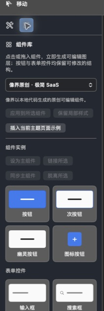
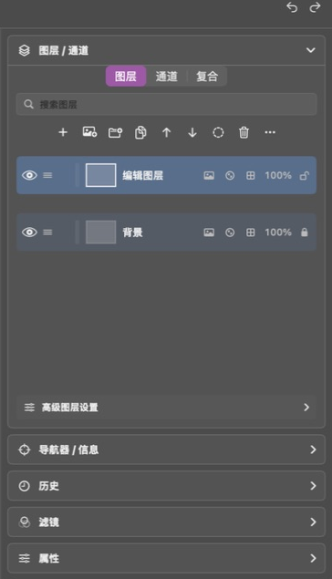
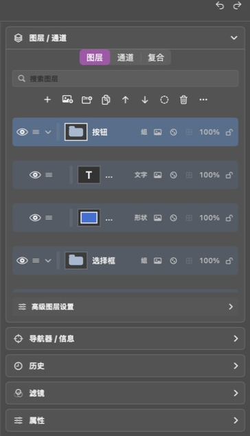
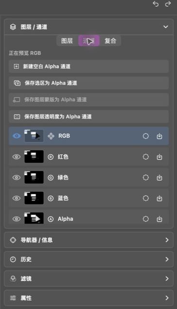
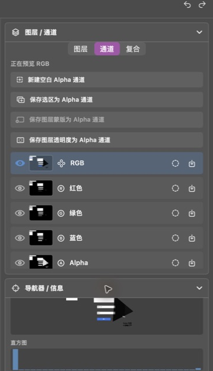
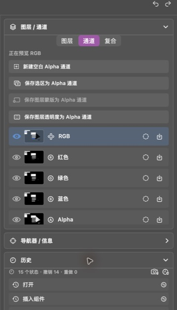

# 第 5 章：组件库、图层、通道与历史

[上一章：文字、形状与路径](04-text-shapes-paths.md) · [返回索引](README.md) · [下一章：文件与快捷键](06-files-shortcuts.md)

## 组件库

组件库与工具箱共用左侧区域。点击“组件库”标签后，可选择主题并插入按钮、表单控件、内容模块、导航、列表和选择控件。

- 单击组件卡片：插入到默认位置。
- 拖动组件卡片：放到画布指定位置。
- “插入当前主题页面示例”：一次生成完整页面结构。
- “应用到所选组件”：把当前主题应用到选中的组件实例。
- “保留局部样式”：主题同步时保留用户修改过的局部值。
- 主组件、链接、同步和脱离用于管理多个组件实例。

## 图层面板

一个新画布通常包含锁定的背景层和一个可编辑像素层：

插入组件后，组、文字与形状会分别出现在图层列表中：

### 顶部操作

| 控件 | 作用 |
|---|---|
| `+` | 新建透明像素图层 |
| 图片加号 | 导入图片为图层 |
| 文件夹加号 | 新建图层组 |
| 复制 | 复制当前图层 |
| 上/下箭头 | 调整图层顺序 |
| 圆形虚线 | 添加图层蒙版 |
| 垃圾桶 | 删除图层 |
| 更多 | 打开高级图层操作 |

### 每个图层行

- 最左侧眼睛：显示或隐藏图层。
- 拖动手柄：改变层级；拖到组的有效区域可加入图层组。
- 缩略图和名称：说明内容类型。
- “文字”“形状”“组”等标签：说明图层结构。
- `100%`：当前图层不透明度。
- 锁：控制图层是否允许编辑。

图层列表支持搜索，可按名称、类型、标签或状态过滤。眼睛位置只控制可见性，不删除内容。

## 通道面板

点击“通道”标签可查看 RGB、红、绿、蓝、Alpha 和自定义 Alpha 通道。

每个通道提供三类操作：

1. 点击通道名称预览该通道。
2. 点击虚线圆图标，把通道亮度载入为选区。
3. 点击保存图标，把当前通道保存为新的 Alpha 通道。

通道预览只改变观察方式；正常导出仍使用完整合成图。

## 复合

“复合”标签用于记录或切换图层组合状态。它适合比较不同可见性、位置和样式方案，例如同一页面的登录态/未登录态或浅色/深色方案。

建议先给复合状态清晰命名，再修改图层。恢复复合时会回到被记录的组合状态。

## 导航器与信息

- 导航器显示画布缩略图和当前可见范围，适合在高倍率下快速定位。
- 信息区域显示尺寸、指针坐标、颜色取样和直方图等辅助数据。
- 导航器不应盖住画布内容，也不会遮挡画布右上缩放工具条。

## 历史面板

每次有效操作都会生成一个历史步骤，例如建立选区、新建文字、盖印可见图层或仿制图章。

- 单击历史步骤：选中该步骤。
- 点击步骤旁的恢复按钮：把文档恢复到该状态。
- 选中某一步后按 `Delete`：从该步骤开始截断后续操作；第一步不能删除。
- `Command+Z`：撤销一步。
- `Command+Shift+Z`：重做一步。
- `Option+Z`：同样可执行撤销。

命名快照与普通历史不同：快照用于长期保留一个状态，可恢复、复制、重新排序或删除，不会随着普通撤销链一起消失。
