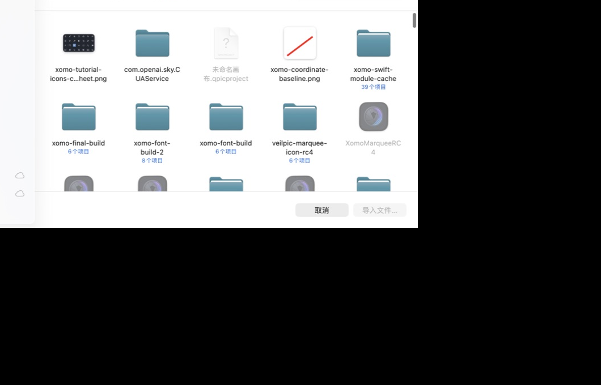
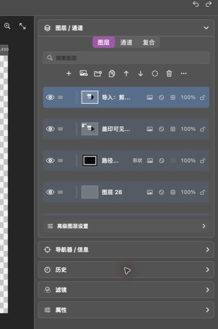

# 第 6 章：文件、剪贴板、导出与快捷键

[上一章：图层、通道与历史](05-layers-channels-history.md) · [返回索引](README.md)

## 项目文件与普通图片

Xomo 项目文件保存完整的图层、对象、通道、蒙版、路径和历史相关结构。PNG/JPG 是扁平图片，适合导入为像素图层或导出分享。

### 打开和保存项目

- “打开项目”或 `Command+O`：打开项目文档。
- “保存项目”或 `Command+S`：保存当前项目。
- 继续编辑的作品应保存项目文件；只导出 PNG/JPG 无法保留全部可编辑结构。

## 导入 PNG 或 JPG

1. 点击“文件”。
2. 选择“导入文件…”。
3. 在文件窗口选择 PNG、JPG 或 JPEG。
4. 点击“导入文件…”。
5. 图片会作为新像素图层加入当前画布并自动选中。

导入不会自动扩大画布。图片尺寸与画布不同时，可用移动和变换控制调整位置、比例或旋转角度。

## 从剪贴板粘贴图片

Xomo 支持两种图片剪贴板来源：

- 在其他软件中复制的位图数据。
- 在 Finder 中复制的 PNG/JPG 文件资源。

把焦点放回 Xomo 画布后按 `Command+V`，会创建名为“导入：剪贴板”的新图层。

其他剪贴板命令：

- `Command+C`：复制当前选区。
- `Command+Shift+C`：复制当前可见合成图像。
- `Command+X`：剪切选区。
- `Command+Shift+V`：把剪贴板图片粘贴到当前选区内的新图层。

## 导出

1. 点击顶部“导出”或文件菜单中的“导出”。
2. 选择格式、尺寸和导出位置。
3. 检查透明背景：PNG 可保留透明；JPG 会使用不透明背景。
4. 完成导出后，项目中的图层结构不会被改变。

`Command+Option+Shift+S` 可直接打开导出流程。

## 常用编辑快捷键

| 快捷键 | 功能 |
|---|---|
| `Command+Z` / `Option+Z` | 撤销 |
| `Command+Shift+Z` | 重做 |
| `Command+A` | 全画布选择 |
| `Command+D` | 取消选区 |
| `Command+Shift+D` | 重新选择 |
| `Command+Shift+I` | 反选 |
| `Command+Option+D` | 羽化选区 |
| `Delete` | 删除选中对象；历史面板有焦点时截断所选历史步骤 |
| 方向键 | 移动对象或选区 `1 px` |
| `Option+方向键` | 移动 `5 px` |
| `Shift+方向键` | 移动 `10 px` |
| `Command+T` | 显示或隐藏变换控制 |
| `Command+J` | 复制选区或图层 |
| `Command+Shift+J` | 剪切选区到新图层 |
| `Command+Shift+N` | 新建图层 |
| `Command+G` | 所选图层成组 |
| `Command+Shift+G` | 取消图层组 |
| `Command+E` | 向下合并 |
| `Command+Shift+E` | 合并可见图层 |
| `Command+Option+Shift+E` | 盖印可见图层到新像素图层 |

## 视图快捷键

| 快捷键 | 功能 |
|---|---|
| `Command++` | 放大 |
| `Command+-` | 缩小 |
| `Command+1` | 100% 实际像素 |
| `Command+0` | 适合窗口 |
| `Command+R` | 显示或隐藏标尺 |
| `Command+;` | 显示或隐藏参考线 |
| `Command+Shift+;` | 开关参考线吸附 |
| `Command+Option+;` | 锁定或解锁参考线 |
| `Command+'` | 显示或隐藏网格 |
| `Tab` | 显示或隐藏工作区面板 |
| `Shift+Tab` | 显示或隐藏右侧停靠面板 |

## 工具快捷键循环

多个工具共享快捷键时，重复按键可在同组工具间循环：

- `W`：魔棒 / 快速选择。
- `J`：修复画笔 / 修补 / 红眼。
- `O`：减淡 / 加深 / 海绵。
- `R`：模糊 / 锐化 / 涂抹。
- `G`：油漆桶 / 渐变。
- `I`：吸管 / 颜色取样器。
- `U`：矩形 / 椭圆。

其余单工具快捷键：`V` 移动、`M` 规则选区、`L` 套索、`C` 裁剪、`B` 画笔、`E` 橡皮擦、`S` 仿制图章、`T` 文字、`P` 钢笔、`H` 抓手、`Z` 缩放。
