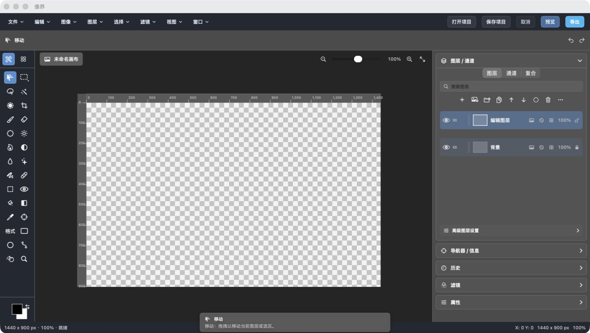
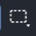
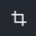
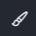
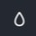
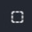
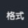
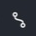

# Xomo（像界）图文教程

> 适用版本：Xomo 2.12.0-rc115（macOS 13 及以上）
> 截图日期：2026-07-12
> 文档约定：画布坐标以左上角为原点；工具快捷键均指英文输入法下的单键。

这套教程从建立画布开始，覆盖当前工具箱中的全部 28 个工具，以及组件库、图层、通道、历史、文件导入、剪贴板粘贴和常用快捷键。所有界面图片均来自实际运行的 Xomo。

## 阅读索引

1. [快速开始与界面认识](01-quick-start.md)
2. [选区、移动、裁剪与画布导航](02-selection-navigation.md)
3. [绘画、填充与照片修饰](03-paint-retouch.md)
4. [文字、形状与钢笔路径](04-text-shapes-paths.md)
5. [组件库、图层、通道与历史](05-layers-channels-history.md)
6. [文件、剪贴板、导出与快捷键](06-files-shortcuts.md)

## 全部工具速查

| 图标 | 工具 | 快捷键 | 主要用途 | 章节 |
|---|---|---:|---|---|
|  | 移动 | `V` | 选择并移动对象、图层或选区 | [第 2 章](02-selection-navigation.md#移动工具) |
|  | 矩形/椭圆选区 | `M` | 建立规则选区 | [第 2 章](02-selection-navigation.md#规则选区工具) |
|  | 套索 | `L` | 手绘不规则选区 | [第 2 章](02-selection-navigation.md#套索工具) |
|  | 魔棒 | `W` | 按颜色相似度选择连续区域 | [第 2 章](02-selection-navigation.md#魔棒工具) |
|  | 快速选择 | `W` 循环 | 用笔刷扩展选区 | [第 2 章](02-selection-navigation.md#快速选择工具) |
|  | 裁剪 | `C` | 改变画布保留范围 | [第 2 章](02-selection-navigation.md#裁剪工具) |
|  | 画笔 | `B` | 在像素图层绘画 | [第 3 章](03-paint-retouch.md#画笔工具) |
|  | 橡皮擦 | `E` | 擦除像素为透明 | [第 3 章](03-paint-retouch.md#橡皮擦工具) |
|  | 仿制图章 | `S` | 从取样点复制像素 | [第 3 章](03-paint-retouch.md#仿制图章工具) |
|  | 减淡 | `O` | 局部提亮 | [第 3 章](03-paint-retouch.md#减淡加深与海绵) |
|  | 加深 | `O` 循环 | 局部压暗 | [第 3 章](03-paint-retouch.md#减淡加深与海绵) |
|  | 海绵 | `O` 循环 | 局部提高饱和度 | [第 3 章](03-paint-retouch.md#减淡加深与海绵) |
|  | 模糊 | `R` | 柔化细节 | [第 3 章](03-paint-retouch.md#模糊锐化与涂抹) |
|  | 锐化 | `R` 循环 | 增强局部边缘 | [第 3 章](03-paint-retouch.md#模糊锐化与涂抹) |
|  | 涂抹 | `R` 循环 | 推动并混合像素 | [第 3 章](03-paint-retouch.md#模糊锐化与涂抹) |
|  | 修复画笔 | `J` | 用邻近纹理修复瑕疵 | [第 3 章](03-paint-retouch.md#修复画笔工具) |
|  | 修补 | `J` 循环 | 用干净区域替换瑕疵区域 | [第 3 章](03-paint-retouch.md#修补工具) |
|  | 红眼 | `J` 循环 | 降低瞳孔中的红色 | [第 3 章](03-paint-retouch.md#红眼工具) |
|  | 油漆桶 | `G` | 填充相近颜色区域 | [第 3 章](03-paint-retouch.md#油漆桶工具) |
|  | 渐变 | `G` 循环 | 绘制前景色到背景色的渐变 | [第 3 章](03-paint-retouch.md#渐变工具) |
|  | 吸管 | `I` | 取样为前景色 | [第 3 章](03-paint-retouch.md#吸管与颜色取样器) |
|  | 颜色取样器 | `I` 循环 | 保留最多四个 RGB 取样点 | [第 3 章](03-paint-retouch.md#吸管与颜色取样器) |
|  | 文字 | `T` | 建立可编辑文字图层 | [第 4 章](04-text-shapes-paths.md#文字工具) |
|  | 矩形 | `U` | 建立矩形形状图层 | [第 4 章](04-text-shapes-paths.md#矩形与椭圆工具) |
|  | 椭圆 | `U` 循环 | 建立椭圆形状图层 | [第 4 章](04-text-shapes-paths.md#矩形与椭圆工具) |
|  | 钢笔 | `P` | 建立和编辑路径 | [第 4 章](04-text-shapes-paths.md#钢笔工具) |
|  | 抓手 | `H` | 平移画布视图 | [第 2 章](02-selection-navigation.md#抓手工具) |
|  | 缩放 | `Z` | 放大或缩小画布 | [第 2 章](02-selection-navigation.md#缩放工具) |

## 使用建议

- 开始破坏性修图前，先复制原图层；画笔、橡皮、仿制和色调类工具会修改像素。
- 文字、矩形、椭圆、路径和组件都会成为独立对象图层，优先保留可编辑结构。
- 每次操作后看窗口底部状态栏：那里会说明操作是否成功、当前工具、指针坐标、画布尺寸和缩放比例。
- 发生误操作时先按 `Command+Z`，也可以在历史面板回到指定步骤。
